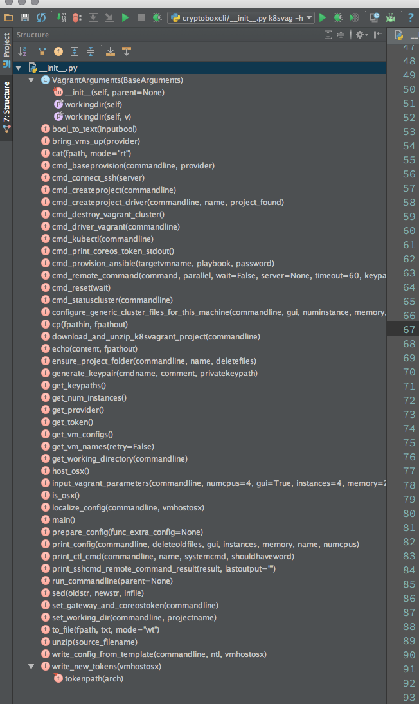

# sortpythonmethods
Rearrange methods alphabetically in a Python source file.
- Python3


## sortorder
1. docstring
2. future imports
3. imports first on alphabet then on length (apo, alpha-pipe-organ)
4. from, modules on apo, imports on alpa
5. classes sorted on baseclassname then on classname alpha (internals of class unchanged)
6. methods sorted on methodname alpha


## pep8
Can be combined with cp-pep8 for consistent readable code

```bash
sortpythonmethods -f myfile.py -w
python2 ~/cp.py -f myfile.py 
```


## example

Source file before sort
```python
"""
Docstring is required
"""
import sys
import http
import email
import concurrent.futures
import os

class Zorro(object):
    pass

class actie(object):
    pass

def applemethod():
    pass
def foobar():
    pass
class Alpha1(object):
    pass


def helloworld():
    pass

class ZZ(object):
    pass


class Alpha2(ZZ):
    pass

```

Run command

```bash
sortpythonmethods -f myfile.py
```


Sorted source file
```python
#!/usr/bin/env python3
# coding=utf-8
"""
Docstring is required
"""

import email
import http
import os
import sys
import concurrent.futures

class ZZ(object):
    pass


class Alpha1(object):
    pass


class Alpha2(ZZ):
    pass


class Zorro(object):
    pass


class actie(object):
    pass


def applemethod():
    pass


def foobar():
    pass


def helloworld():
    pass

```

## completeness
- baseclasses
- globals
- globalmethod calls
- comments

## todo
- global pycharm directives

##screenshot

